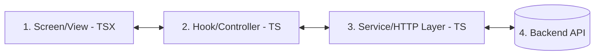

# Guia do Desenvolvedor SEMOB: Criação de Telas, Integração CDP & CRUD Responsivo

Este guia foi elaborado para capacitar desenvolvedores iniciantes a criar novas telas no SISMOB Frontend Boilerplate, integrá-las de forma segura com o sistema de autenticação e CDP (Controle de Dados e Perfis), e implementar operações completas de CRUD (Criação, Leitura, Atualização e Deleção) com total suporte para dispositivos móveis.

---

## 1. Arquitetura em 3 Camadas e a "Regra 90/10"

Para manter o código escalável, de fácil manutenção e legível para iniciantes, adotamos uma separação rígida de responsabilidades em **3 Camadas**.

### O Fluxo de Dados:


1. **Screen / View (`src/screens/*`)**: Contém apenas a estrutura visual (JSX/TSX) e estilos. **Regra de Ouro (Limite de 50 Linhas de lógica)**: O arquivo de tela não deve conter lógica complexa de estado, apenas chamar funções do hook. Pelo menos 90% da lógica e 100% da reatividade de dados devem estar no Custom Hook.
2. **Hook / Controller (`src/hooks/*`)**: Um Custom Hook que gerencia o estado local de renderização, loading, mensagens de erro, estados de formulário e orquestra chamadas ao Service.
3. **Service / Data Layer (`src/services/*`)**: Classe ou objeto que centraliza as chamadas HTTP usando a instância configurada do Axios (`api`). Trata tipagem de entrada/saída e isola o frontend das rotas brutas do backend.

---

## 2. Passo a Passo: Criando uma Nova Tela e Mapeando com o CDP

Para criar uma tela e protegê-la com o CDP, siga estes 5 passos simples:

### Passo 1: Criar/Registrar as Tipagens (`src/types/index.ts`)
Defina a interface correspondente ao recurso que deseja manipular.

```typescript
export interface Veiculo {
  idVeiculo: number;
  placa: string;
  prefixo: string;
  nmOperadora: string;
  anoFabricacao: number;
}
```

### Passo 2: Criar o Service (`src/services/veiculoService.ts`)
Centraliza as chamadas de API usando a instância `api` (configurada com os interceptores automáticos de JWT e `x-user-id` no cabeçalho).

```typescript
import { api } from '../config/api';
import { Veiculo } from '../types';

export const VeiculoService = {
  async listar(placaFiltro: string): Promise<Veiculo[]> {
    const { data } = await api.get<Veiculo[]>('/veiculos', {
      params: { placa: placaFiltro }
    });
    return data;
  },

  async cadastrar(novoVeiculo: Omit<Veiculo, 'idVeiculo'>): Promise<Veiculo> {
    const { data } = await api.post<Veiculo>('/veiculos', novoVeiculo);
    return data;
  },

  async deletar(idVeiculo: number): Promise<void> {
    await api.delete(`/veiculos/${idVeiculo}`);
  }
};
export default VeiculoService;
```

### Passo 3: Criar o Hook (`src/hooks/useVeiculos.ts`)
Isola a lógica reativa (loading, manipulação de dados, etc.) para que a tela não passe de 50 linhas de lógica.

```typescript
import { useState, useCallback } from 'react';
import { VeiculoService } from '../services/veiculoService';
import { Veiculo } from '../types';

export const useVeiculos = () => {
  const [loading, setLoading] = useState(false);
  const [veiculos, setVeiculos] = useState<Veiculo[]>([]);
  const [erro, setErro] = useState<string | null>(null);

  const carregarVeiculos = useCallback(async (placa: string = '') => {
    setLoading(true);
    setErro(null);
    try {
      const dados = await VeiculoService.listar(placa);
      setVeiculos(dados);
    } catch (err: any) {
      setErro('Erro ao obter lista de veículos.');
    } finally {
      setLoading(false);
    }
  }, []);

  const criarVeiculo = useCallback(async (placa: string, prefixo: string, nmOperadora: string, anoFabricacao: number) => {
    setLoading(true);
    setErro(null);
    try {
      await VeiculoService.cadastrar({ placa, prefixo, nmOperadora, anoFabricacao });
      await carregarVeiculos(); // Atualiza a lista após cadastro
      return true;
    } catch (err: any) {
      setErro('Erro ao registrar novo veículo.');
      return false;
    } finally {
      setLoading(false);
    }
  }, [carregarVeiculos]);

  const excluirVeiculo = useCallback(async (id: number) => {
    setLoading(true);
    try {
      await VeiculoService.deletar(id);
      await carregarVeiculos();
      return true;
    } catch (err) {
      setErro('Não foi possível excluir o veículo.');
      return false;
    } finally {
      setLoading(false);
    }
  }, [carregarVeiculos]);

  return { veiculos, loading, erro, carregarVeiculos, criarVeiculo, excluirVeiculo, setErro };
};
```

### Passo 4: Mapear os Perfis no Módulo do Sistema (`src/config/modules.ts`)
Adicione a tela na lista de módulos e associe com um código de rota do CDP.
O hook `useModules` intercepta `usuario.rotasPermitidas` do CDP e esconde/mostra a opção na barra de navegação.

```typescript
// Exemplo de inclusão em src/config/modules.ts
const VeiculosList = lazy(() => import('../screens/VeiculosList'));

// ... dentro do array raw_modulos_sistema:
{
  id: 'suop-vehicles',
  titulo: 'Veículos',
  icone: 'Bus',
  rota: 'suop-vehicles', // Deve coincidir com o cadastro no CDP
  componente: VeiculosList
}
```

### Passo 5: Controlar Acesso com CDP na Tela (`src/screens/VeiculosList.tsx`)
Consuma o hook de autenticação `useAuth()` para verificar permissões granulares:
* `temAcesso('/veiculos', 'LEITURA')`: Controla se o usuário pode ver a tela ou pesquisar.
* `temEscrita('/veiculos')`: Habilita ou esconde botões de modificação (como cadastrar, editar e excluir).

---

## 3. Tutorial de CRUD Completo para Iniciantes

Aqui está o código completo do componente visual de exemplo (`src/screens/VeiculosList.tsx`) que implementa a listagem, filtro, cadastro e exclusão usando componentes padronizados do SISMOB (`Button` e `Popup`).

```tsx
import React, { useState, useEffect } from 'react';
import { useVeiculos } from '../hooks/useVeiculos';
import { useAuth } from '../hooks/useAuth';
import { Button } from '../components/Button';
import { Popup } from '../components/Popup';
import { ShieldAlert, Plus, Search, Trash2, Bus } from 'lucide-react';

export const VeiculosList: React.FC = () => {
  const { veiculos, loading, erro, carregarVeiculos, criarVeiculo, excluirVeiculo } = useVeiculos();
  const { temAcesso, temEscrita } = useAuth();
  
  // Estados de Controle de Tela (Modais e Formulários)
  const [filtro, setFiltro] = useState('');
  const [cadastroOpen, setCadastroOpen] = useState(false);
  const [placa, setPlaca] = useState('');
  const [prefixo, setPrefixo] = useState('');
  const [operadora, setOperadora] = useState('');
  const [ano, setAno] = useState(new Date().getFullYear());
  const [alertOpen, setAlertOpen] = useState(false);

  // Verificação de Nível de Permissão CDP
  const temLeitura = temAcesso('/veiculos', 'LEITURA');
  const temModificacao = temEscrita('/veiculos');

  // Inicialização e Pesquisa
  useEffect(() => {
    if (temLeitura) carregarVeiculos();
  }, [temLeitura, carregarVeiculos]);

  const handlePesquisar = (e: React.FormEvent) => {
    e.preventDefault();
    if (!temLeitura) {
      setAlertOpen(true);
      return;
    }
    carregarVeiculos(filtro);
  };

  const handleCriar = async (e: React.FormEvent) => {
    e.preventDefault();
    if (!temModificacao) {
      setAlertOpen(true);
      return;
    }
    const sucesso = await criarVeiculo(placa, prefixo, operadora, Number(ano));
    if (sucesso) {
      setCadastroOpen(false);
      setPlaca('');
      setPrefixo('');
      setOperadora('');
    }
  };

  const handleExcluir = async (id: number) => {
    if (!temModificacao) {
      setAlertOpen(true);
      return;
    }
    if (window.confirm('Tem certeza que deseja remover este veículo?')) {
      await excluirVeiculo(id);
    }
  };

  // 1. Caso sem permissão de leitura
  if (!temLeitura) {
    return (
      <div style={{ padding: '2rem', background: 'var(--semob-surface)', borderRadius: '0.75rem', border: '1px solid var(--semob-danger)', textAlign: 'center' }}>
        <ShieldAlert size={48} style={{ color: 'var(--semob-danger)', margin: '0 auto 1rem' }} />
        <h4 style={{ color: 'var(--semob-text)' }}>Acesso Negado</h4>
        <p style={{ color: 'var(--semob-text-muted)', fontSize: '0.85rem' }}>
          Seu perfil não possui permissão de leitura para o endpoint `/veiculos`.
        </p>
      </div>
    );
  }

  // 2. Tela Principal do CRUD
  return (
    <div style={{ padding: '1.5rem', background: 'var(--semob-surface)', borderRadius: '1rem', border: '1px solid var(--semob-border)' }}>
      
      {/* Cabeçalho */}
      <div style={{ display: 'flex', justifyContent: 'space-between', alignItems: 'center', marginBottom: '1.5rem', flexWrap: 'wrap', gap: '0.75rem' }}>
        <h3 style={{ color: 'var(--semob-text)', margin: 0, display: 'flex', alignItems: 'center', gap: '0.5rem' }}>
          <Bus style={{ color: 'var(--semob-primary)' }} /> Frota de Veículos
        </h3>
        
        {temModificacao && (
          <Button size="sm" onClick={() => setCadastroOpen(true)}>
            <Plus size={16} style={{ marginRight: '0.25rem' }} /> Adicionar Veículo
          </Button>
        )}
      </div>

      {/* Formulário de Busca */}
      <form onSubmit={handlePesquisar} style={{ display: 'flex', gap: '0.75rem', marginBottom: '1.5rem' }}>
        <div style={{ position: 'relative', flex: 1 }}>
          <Search size={16} style={{ position: 'absolute', left: '12px', top: '50%', transform: 'translateY(-50%)', color: 'var(--semob-text-muted)' }} />
          <input
            type="text"
            placeholder="Filtrar por placa..."
            value={filtro}
            onChange={(e) => setFiltro(e.target.value)}
            style={{
              width: '100%',
              padding: '0.55rem 1rem 0.55rem 2.25rem',
              borderRadius: '0.5rem',
              border: '1px solid var(--semob-border)',
              background: 'var(--semob-bg)',
              color: 'var(--semob-text)',
              outline: 'none',
              fontSize: '0.85rem'
            }}
          />
        </div>
        <Button type="submit" variant="secondary" size="sm" loading={loading}>
          Buscar
        </Button>
      </form>

      {/* Grid Responsivo de Veículos */}
      {veiculos.length === 0 ? (
        <p style={{ color: 'var(--semob-text-muted)', textAlign: 'center', padding: '1rem' }}>Nenhum veículo encontrado.</p>
      ) : (
        <div className="grid-2">
          {veiculos.map(v => (
            <div key={v.idVeiculo} style={{ padding: '1rem', background: 'var(--semob-bg)', border: '1px solid var(--semob-border)', borderRadius: '0.75rem', display: 'flex', justifyContent: 'space-between', alignItems: 'center' }}>
              <div>
                <strong style={{ color: 'var(--semob-text)', fontSize: '1rem', display: 'block' }}>{v.placa} ({v.prefixo})</strong>
                <span style={{ color: 'var(--semob-text-muted)', fontSize: '0.78rem' }}>{v.nmOperadora} • Ano {v.anoFabricacao}</span>
              </div>
              
              {temModificacao && (
                <button
                  onClick={() => handleExcluir(v.idVeiculo)}
                  style={{ background: 'none', border: 'none', color: 'var(--semob-danger)', cursor: 'pointer', padding: '0.5rem', borderRadius: '0.375rem' }}
                >
                  <Trash2 size={18} />
                </button>
              )}
            </div>
          ))}
        </div>
      )}

      {/* POPUP DE CADASTRO */}
      <Popup
        isOpen={cadastroOpen}
        onClose={() => setCadastroOpen(false)}
        title="Cadastrar Novo Veículo"
        variant="info"
        actions={
          <div style={{ display: 'flex', gap: '0.5rem' }}>
            <Button variant="outline" size="sm" onClick={() => setCadastroOpen(false)}>Cancelar</Button>
            <Button size="sm" onClick={handleCriar} loading={loading}>Salvar</Button>
          </div>
        }
      >
        <form onSubmit={handleCriar} style={{ display: 'flex', flexDirection: 'column', gap: '1rem' }}>
          <div style={{ display: 'flex', flexDirection: 'column', gap: '0.35rem' }}>
            <label style={{ fontSize: '0.8rem', color: 'var(--semob-text-muted)', fontWeight: 600 }}>Placa do Veículo</label>
            <input type="text" value={placa} onChange={(e) => setPlaca(e.target.value)} required style={{ padding: '0.55rem', background: 'var(--semob-bg)', border: '1px solid var(--semob-border)', color: 'var(--semob-text)', borderRadius: '0.5rem' }} />
          </div>
          <div style={{ display: 'flex', flexDirection: 'column', gap: '0.35rem' }}>
            <label style={{ fontSize: '0.8rem', color: 'var(--semob-text-muted)', fontWeight: 600 }}>Prefixo</label>
            <input type="text" value={prefixo} onChange={(e) => setPrefixo(e.target.value)} required style={{ padding: '0.55rem', background: 'var(--semob-bg)', border: '1px solid var(--semob-border)', color: 'var(--semob-text)', borderRadius: '0.5rem' }} />
          </div>
          <div style={{ display: 'flex', flexDirection: 'column', gap: '0.35rem' }}>
            <label style={{ fontSize: '0.8rem', color: 'var(--semob-text-muted)', fontWeight: 600 }}>Operadora</label>
            <input type="text" value={operadora} onChange={(e) => setOperadora(e.target.value)} required style={{ padding: '0.55rem', background: 'var(--semob-bg)', border: '1px solid var(--semob-border)', color: 'var(--semob-text)', borderRadius: '0.5rem' }} />
          </div>
        </form>
      </Popup>

      {/* POPUP DE BLOQUEIO DE AÇÃO (CDP) */}
      <Popup
        isOpen={alertOpen}
        onClose={() => setAlertOpen(false)}
        title="Ação não Autorizada"
        variant="danger"
      >
        Você não possui privilégios de **Escrita** no CDP para realizar modificações em veículos.
      </Popup>

    </div>
  );
};
export default VeiculosList;
```

---

## 4. Guia de Responsividade e Suporte Mobile Completo

O boilerplate do SISMOB adota uma estratégia adaptativa híbrida baseada em **Media Queries CSS** e **Estados de Componentes React**, proporcionando uma experiência de alto nível em dispositivos móveis.

### A Barra Lateral Móvel (Sidebar Drawer)
1. **No Desktop (Telas >= 768px)**: A Sidebar é mantida como uma coluna lateral (`position: sticky`), podendo ser expandida ou colapsada em formato de ícones pelo botão de gatilho no rodapé da Sidebar.
2. **No Mobile (Telas < 768px)**:
   - A Sidebar torna-se um painel suspenso (`position: fixed`) com `translateX(-100%)`.
   - Quando ativada, ela se move para a tela (`translateX(0)`) com uma transição suave de curva.
   - Um **Overlay Escurecido (backdrop)** cobre o restante da tela para direcionar o foco, fechando o menu automaticamente se clicado.
   - O menu é acionado por um botão de hambúrguer (`Menu`) localizado no `Headerbar`.

### Classes Utilitárias Responsivas (`src/index.css`)
Utilize sempre as seguintes classes utilitárias para evitar a quebra de layouts em telas de celulares ou tablets:

1. `.hide-mobile`: Oculta o elemento automaticamente em dispositivos móveis (telas menores que 768px). Ideal para colunas secundárias de tabelas ou dados detalhados do Headerbar.
2. `.show-mobile-flex`: Torna o elemento visível como Flex Container apenas no Mobile (telas < 768px). Excelente para inputs de seleção alternativos e botões de navegação móvel.
3. `.grid-2`: Organiza elementos em 2 colunas no desktop, mas empilha-os automaticamente em **1 coluna** no mobile, com espaçamentos otimizados de forma fluida.
4. `.flex-row-md`: Organiza elementos horizontalmente no desktop, mas empilha-os na vertical no celular. Ideal para layouts de documentos com asides laterais.

---

## 5. Como os Cabeçalhos de Segurança (Token e ID) são Injetados?

Toda vez que você faz uma requisição HTTP pelo `apiInterceptor.ts`, o frontend intercepta a chamada e anexa dois cabeçalhos cruciais para o backend e para o CDP:
1. `Authorization: Bearer <JWT_TOKEN>` (obtido da autenticação LDAP/CDP).
2. `x-user-id: <NUMERIC_ID>` (ID único numérico do usuário, exigido para logs de auditoria).

Estes dados são persistidos no `tokenStore.ts` e sincronizados em tempo real pelo contexto `useAuth.tsx`. O programador frontend não precisa injetá-los manualmente em cada requisição.

---

Este tutorial serve como base de onboarding para novos desenvolvedores na SEMOB. Siga sempre o padrão de 3 camadas para manter a qualidade de código lá no topo!
